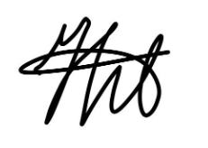
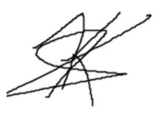
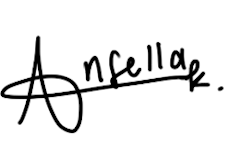
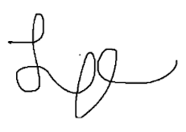

## COSC 310 Team Agreement

Version: V1  
Last updated: September 22, 2026

## Part 1 - Team Information

Team name: Devil Fruit Devs

Team members: Leo Cabral, Leyla Huseynova, Eleonora Ansella Kartono, Keenan Selbee

Lab section: Friday

## Part 2 - Team Agreement

### 1. Team Values

What values guide the team

- Communication  
- Respect  
- Reliability  
- Enjoyable  
- Courtesy

### 2. Meetings

- We have organized a Discord group chat to communicate with the team members  
- We have each other’s contacts in case of emergencies  
- All of the schedules and important notes are included in the \#announcement section of the group chat

### 3. Communication

- We will use our Discord group for day-to-day communication  
- Complete the joint assignments/tasks in person or via scheduled call   
- We have an Instagram group for notification issues in Discord  
- Call the provided number in case of missed text or messages

### 4. Response Expectations

- Aim for within 24 hours response  
- Communicate any issues you are experiencing with the team’  
- As soon as possible if possible

### 5. Respect & Professional Conduct

- Let everyone have the chance to contribute ideas  
- No personal attacks or jokes that make people feel uncomfortable  
- Follow team plans: show up to meetings and follow the deadlines

### 6. Accountability

- Each task will have an owner and a deadline  
- For missed tasks we will check what happened and agree on next steps  
- AI use is disclosed in PROVENANCE & all AI code is fully understood

### 7. Decision-Making

- Voting: we will resolve tied votes via consulting technical documents or TAs. Coin flip last resort.  
- Have a thorough discussion in case opinions are split, align it with what is better based on online resources or what TA recommends the team

### 8. Conflict Resolution

- If there is a disagreement, we will talk about it as a group first and give everyone a chance to explain their side  
- We will try to agree on a solution that works for everyone  
- If we still can’t resolve the issue, then we will ask the TA for help

### 9. Anticipated Challenges

- Deciding on a shared vision for the project  
- Different coding styles and naming preferences ie camelCase vs PascalCase vs kebab-case vs snake\_case. We should agree on a general style for the project’s files, variables, etc. eg. DESIGN.md, style-guide.md  
- Git branch merge conflicts  
- Backend logic planning  
- Documentation style  
- Different platform issues

### 10. Individual Commitments

Leo Cabral: I’ll respond immediately to a message  if I’m not busy. Be consistent with work and responsible for mistakes. I’m committed to finishing my work that is assigned to me. Make the group progress project be enjoyable to all my group partners. I’ll try to resolve issues on the project and with my other group members as a priority.

Leyla Huseynova: I will be consistent when following up with the team, communicating my issues and tasks, and following the deadlines on time. I understand that it is my responsibility to participate for the team even outside of the scope of my individual tasks and work, and the importance of contributing fairly to the team and the group project.

Eleonora Ansella Kartono: I will complete my assigned tasks on time and communicate regularly with the team about my progress. I will attend meetings, contribute fairly to the project, and help my teammates when needed. If I run into any problems or concerns, I will bring them up early so the team can work together to resolve them.

Keenan Selbee: I will start my tasks early, communicate frequently, and do a fair share of the work. I will let the group members know if I am stuck or behind. I will understand and be able to explain the work I contribute or review. I will ensure I know how the main parts of the application fit together.

## Signatures

Leyla Huseynova

Keenan Selbee  

 

Eleonora Ansella Kartono

Leo Arthur Cabral  

